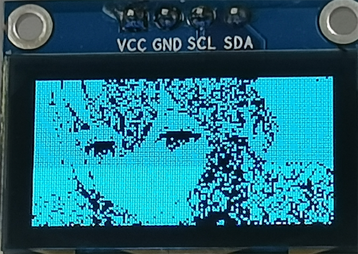
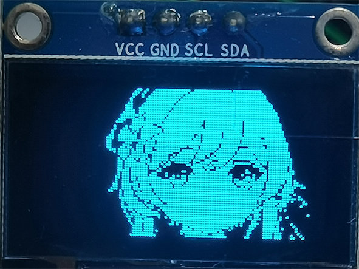

# -ESP8266-0.96-OLED-
# 基于ESP8266和0.96寸OLED的实时显示器

# 硬件
1.  ESP8266 （12E）
2.  Arduino   IDE
3.  0.96寸OLED，SSD1306主控， IIC总线
4.  PC端的python环境
# 使用方法

1. 使用ArduinoIDE打开.ino文件，并上传至ESP8266
2. 使用串口将ESP8266连接至PC
3. 在python环境中安装需要的库
4. 在python中设置正确的串口号
5. 运行python脚本
